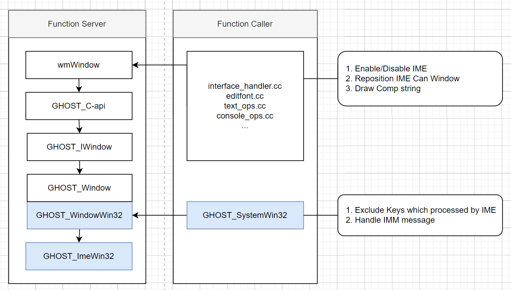

# 技术说明文档

施工中...当前的内容仅为梗概。

GHOST_ImeWin32 提供核心功能。

其使用者分为两类：

- GHOST_SystemWin32

    负责处理按键和 IMM 消息，并且将消息转为 GHOST 输入法消息。

    GHOST 输入法消息派送到文本框和编辑器，然后再被处理。

- 文本框、文本物体编辑模式、文本编辑器、控制台

    完成输入法的启停，候选窗口重定位和响应 GHOST 输入法消息。

    核心文件：

    - interface_handler.cc - 对应文本框
    - editfont.cc - 对应文本物体编辑模式
    - text_ops.cc - 对应文本编辑器
    - console_ops.cc - 对应控制台
