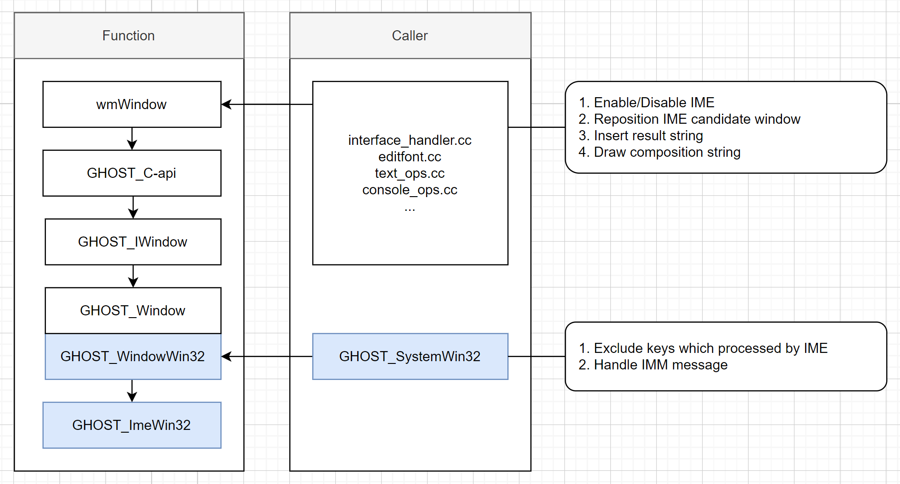
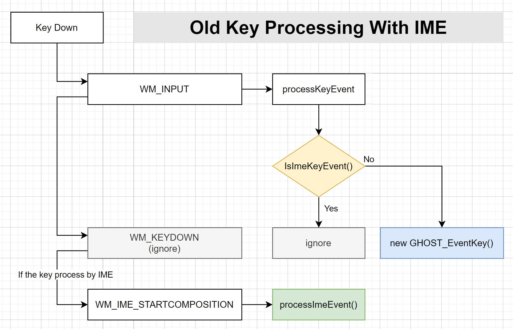
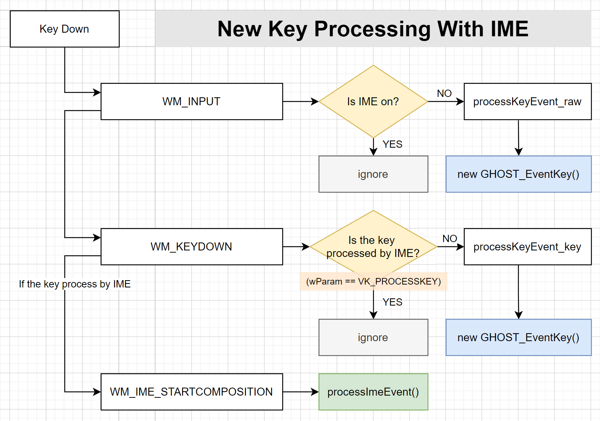

# 介绍

大家好，我发现 Blender 在 Windows 平台上对输入法的支持尚有欠缺，于是研究了一下改进方案，以便提高 Blender 对输入法的支持。

输入法是一个辅助用户输入中文、日文、韩文等文字的程序。

具体的介绍请参考微软官方文档：

[Input Method Editors (IME)](https://learn.microsoft.com/en-us/globalization/input/input-method-editors)
[Input Method Manager (IMM)](https://learn.microsoft.com/en-us/windows/win32/intl/input-method-manager)

目前 Blender 对输入法的支持情况：

- 文本框支持输入法，但存在问题：

    - 激活文本框后直接退出文本框，再按下快捷键，如：“G”来移动物体时，输入法拦截了按键，并弹出输入法的候选窗口，导致用户无法正常使用程序的快捷键。

        问题原因：`ui_textedit_end` 中调用 `ui_textedit_ime_end` 的前提条件是 `win->ime_data != nullptr`，而 `win->ime_data` 只有在用户至少触发一次输入法的文本合成流程时才不会为空。因此当用户激活文本框，程序启用输入法后，如果用户直接退出文本框，程序不会停用输入法。这就导致了用户的后续按键可能会被输入法拦截。

    - 按下某些按键时，无法输入字符。

        问题原因：Blender 仅在 `WM_INPUT` 中处理按键消息，但在 `WM_INPUT` 中无法得知该按键是否由输入法处理（只能在 `WM_KEYDOWN` 等通过 `wParam == VK_PROCESSKEY` 得知按键是否由输入法处理），而当前的解决方案是程序假设某些按键必然由输入法处理，从而在 `WM_INPUT` 中跳过对这些按键的处理。

        如果程序认为某个按键一定会被输入法处理，但输入法并不处理该按键，则该按键不被任何程序处理。

        也就是说，只要输入法对按键的处理逻辑和 `GHOST_ImeWin32::IsImeKeyEvent` 中的不同，则一定会导致该按键无法输入字符。

        遗憾的是，输入法对按键的处理逻辑是复杂的，同一种语言下的不同输入法，其处理逻辑也是不同的。

        以下是该问题的一些具体例子，使用的是微软拼音输入法，且处于中文输入模式：

        - 启用大写锁定，按下字母按键，无法输入字符。

        - 按下主键盘 "/" 键，无法输入字符。

    - 数值框意外地支持了输入法。这会导致部分输入法干扰用户输入。根据当前数值框的功能，用户是无需在数值框中使用复杂文字的，因此在数值框中停用输入法可以避免输入法的意外干扰。

        问题原因：Blender 本身是有“不在数值框中启用输入法”的设计的（`ui_textedit_begin`），但是在 `widget_draw_text` 中却意外通过 `ui_but_ime_reposition` 启用了输入法。

    - 不支持微软朝鲜语输入法。

        问题原因：Blender 将合成信息复制到 `wmWindow` 的 `ime_data` 中以便向其它组件传递合成信息，但微软朝鲜语输入法发送的合成消息过于紧密，导致后一个合成消息的合成信息覆盖前一个，最终导致文本输入无法正常进行。

- 3D视图的文本编辑模式、文本编辑器、控制台不支持输入法。

- 使用输入并搜索时，第一个字母按键无法被输入法捕获。

改进后：

- 文本框支持输入法，数值框无需支持输入法。

- 3D视图的文本编辑模式、文本编辑器、控制台支持输入法。

- 使用输入并搜索时，第一个字母按键能够被输入法捕获。

- 良好地支持输入法，即实现《输入法感知程序设计指南》（详见后文）中的关键要求，包括：

    - 正确启停输入法；

    - 正确处理按键消息；

    - 正确处理合成消息；

    - 正确定位候选窗口。

下面的视频展示了修改前和修改后的状况：

[ime-aware-in-windows-before-after-comparison](./files/ime-aware-in-windows.mp4)

# 修改内容

为了让事情尽量简单，我基于微软官方的示例写了一个精简的输入法感知示例程序：

[https://github.com/Arius-Cr/wire_app_ime_aware_example](https://github.com/Arius-Cr/wire_app_ime_aware_example)

其中包含了一份我自行编写的基于 IMM 的《输入法感知程序设计指南》。

该指南向程序员介绍了实现一个支持输入法的程序所需要完成和遵守的事项。

下文假设你已经阅读过该示例和《输入法感知程序设计指南》。

现在我将详细列出本次提交包含的改动内容。

下图列出了相关功能的关系：



注意：本次对源码的所有改动都仅针对 Windows 平台，因此和其它平台共用的输入法相关的代码将保持不变。所以你会看到这样的源码：

```
#if defined(WITH_INPUT_IME) && !defined(WIN32)
// ... 原本和输入法相关的代码，在非 Windows 平台上保持不变
#endif

#if defined(WITH_INPUT_IME) && defined(WIN32)
// ... 新增的输入法相关的代码，仅针对 Windows 平台
#endif
```

## 1. 启停输入法

Blender 的界面在设计指南中属于 Direct UI 类别，因此键盘焦点在各个控件之间转移时，需要及时处理输入法的启停状态。

通过 `wm_window_IME_begin` 函数可以为当前窗口启用输入法，而通过 `wm_window_IME_end` 函数可以为当前窗口停用输入法。

对于文本框：

- 当文本框进入编辑状态时（`ui_textedit_ime_begin`），启用输入法。

- 当文本框退出编辑状态时（`ui_textedit_ime_end`），停用输入法。

文本框不包括数值框（`UI_BTYPE_NUM` 和 `UI_BTYPE_NUM_SLIDER` 类型的按钮）。

对于编辑器：

我在 `ARegionType` 中新增了一个回调函数 `on_activation_changed`，当活动区块（`screen->active_region`）发生改变时，会首先调用已经失去焦点的 Region 的 `on_activation_changed` 回调函数，然后再调用已经获得焦点的 Region 的 `on_activation_changed` 回调函数。

目前仅有 3D 视图、文本编辑器和控制台的主区块会关注焦点的获得或失去。

- 当编辑器的主区块获得焦点时，如果编辑器当前允许用户进行文本输入，则启用输入法。

- 当编辑器的主区块失去焦点时，则停用输入法。

- 当编辑器自身状态改变时，如果焦点在编辑器的主区块中，且编辑器当前允许用户进行文本输入，则启用输入法，否则停用输入法。

3D 视图启用输入法的条件：

- 处于文本编辑模式

文本编辑器启用输入法的条件：

- 存在关联的文本对象

控制台启用输入法的条件：

- （无限制，即只要主区块具有焦点就启用输入法）

关键函数：
- `ui_textedit_ime_begin`
- `ui_textedit_ime_end`
- `view3d_enable_ime`
- `view3d_disable_ime`
- `text_enable_ime`
- `text_disable_ime`
- `console_enable_ime`
- `console_disable_ime`

## 2. 处理按键消息

本修改对 Blender 的按键消息处理流程进行了改造：

- 处理 `WM_INPUT` 消息时，如果输入法已经启用，则忽略绝大部分的按键消息，仅处理 OS 键等特殊按键。

- 处理 `WM_KEYDOWN` 等消息时，如果输入法已经启用，则：

    - 如果按键由输入法处理（`wParam == VK_PROCESSKEY`），则忽略。

    - 如果按键不由输入法处理，则按照 `WM_INPUT` 原本的逻辑处理按键消息。

简单来说就是，输入法启用时，大部分按键会在 `WM_KEYDOWN`、`WM_KEYUP` 等消息中处理，而不是 `WM_INPUT`。

下面的示意图能够更清晰展示前后两种按键消息处理流程：





经过这样改造后，Blender 能够准确得知某个按键是否被 IME 处理。

关键函数：
- `GHOST_SystemWin32::s_wndProc`

## 3. 处理合成消息

在 Blender 原本的处理逻辑下，做了以下更改：

- 调整目标（`target_start` 和 `target_end`）的计算规则。

    原本的计算规则需要考虑输入语言的类别。实际上可以无需考虑输入语言。

    修改后的判断规则如下：

    - 首先检查是否存在 `ATTR_TARGET_CONVERTED` 或 `ATTR_TARGET_NOTCONVERTED` 属性，如果存在则以其作为目标。

        适用于日语输入法和部分繁体中文输入法。

    - 否则检查是否存在分段，如果存在则以合成光标所在的分段作为目标。

        适用于部分中文输入法。

    - 否则将整个合成文本作为目标。

        适用于朝鲜语及其它输入法。

    “目标” 主要用于定位候选窗口位置，但在 Blener 中同时用于绘制合成文本下滑线。

    但实际上 “目标” 不适合用于绘制合成文本下划线，因为其逻辑和常规的不同（请参考示例程序相关代码），但也并非不可，所以本修改并没有对下划线的绘制逻辑进行修改。

- 将合成信息记录在 `GHOST_Event` 和 `wmEvent` 中。

    原本的方案是将合成信息记录在 `wmWindow` 的 `ime_data` 字段中。但这个方案有个问题。因为 Blender 对消息的处理不是逐个进行的，而是批量进行的（如果我没有理解错的话）。当合成消息以非常紧凑的方式触发时，后一个合成消息的合成信息会覆盖上一个合成消息的合成信息，等最终的事件处理器处理事件时，会出现数据不同步的问题。

    该问题可以通过新版的微软朝鲜语输入法触发，它会发送如下合成消息序列：
    1. WM_IME_COMPOSITION (with GCS_RESULTSTR)
    2. WM_IME_ENDCOMPOSITION
    3. WM_IME_STARTCOMPOSITION
    4. WM_IME_COMPOSITION (with GCS_COMPSTR)

    第 1 个消息到达时，合成信息写入到 `wmWindow.ime_data`，第 4 个消息到达时，其合成信息写入到 `wmWindow.ime_data`，覆盖了第 1 个消息的合成信息。而事件处理器在第 4 个消息后才接收到第 1 个消息，此时其获得的合成信息时是第 4 个消息的而不是第 1 个的，从而导致了信息混乱。

    为了规避这个问题，需要将合成消息当时的合成信息记录在 `GHOST_Event` 和 `wmEvent` 对象中。

    修改后，在 Windows 平台中，将完全不使用 `wmWindow` 的 `ime_data` 字段，而是使用：

    - `GHOST_Event` 的 `m_data` 字段

    - `wmEvent` 的 `customdata` 字段

    - `uiBut` 的 `ime_data` 字段（用于 `widget_draw_text`）

- 使用新增的操作和按键绑定，让编辑器（3D视图、文本编辑器、控制台）支持输入法。

    新增的操作包括：

    - XXX_OT_ime_input 系列：
        - `FONT_OT_ime_input`
        - `TEXT_OT_ime_input`
        - `CONSOLE_OT_ime_input`

    - XXX_OT_ime_insert 系列：
        - `FONT_OT_ime_insert`
        - `TEXT_OT_ime_insert`
        - `CONSOLE_OT_ime_insert`

    XXX_OT_ime_input 会和 `WM_IME_COMPOSITE_START` 事件绑定。

    XXX_OT_ime_insert 会被 XXX_OT_ime_input 调用以插入结果文本，以便提供撤销/重做功能。

    `WM_IME_COMPOSITE_START` 等事件本身就存在，但没有导出到 BPY，为了能让操作可以绑定和接收这些事件，我将这些事件导出到了 BPY。

    XXX_OT_ime_input 的工作机制为：

    - `WM_IME_COMPOSITE_START` 事件触发时，根据按键绑定会触发 XXX_OT_ime_input 以模态方式运行。

    - 操作监听后续的 `WM_IME_COMPOSITE_EVENT` 和 `WM_IME_COMPOSITE_END` 事件，直到 `WM_IME_COMPOSITE_END` 时结束运行。

    - 在操作运行过程中，操作会将结果文本通过 XXX_OT_ime_insert 插入到待编辑文本中，而对于合成文本会临时插入到待编辑文本中。

    - 当合成文本更新时，会删除上一次插入的合成文本，并插入新的合成文本。

    - 当操作结束时，会确保所有临时插入的合成文本全部清除。

    XXX_OT_ime_input 还会和 `WM_IME_COMPOSITE_EVENT` 事件绑定。这样做仅仅是为了支持微软朝鲜语输入法（兼容模式）。该输入法生成的合成消息存在缺陷，会在 `WM_IME_STARTCOMPOSITION` 到 `WM_IME_ENDCOMPOSITION` 之外发送 `WM_IME_COMPOSITION` 消息。因此需要 XXX_OT_ime_input 和 `WM_IME_COMPOSITE_EVENT` 事件绑定以便捕获这个逃逸的消息。该逃逸的消息只包含结果文本。

关键函数：
- `GHOST_ImeWin32::GetCaret`
- `GHOST_SystemWin32::processImeEvent`
- `wm_event_add_ghostevent`
- `ui_do_but_textedit`
- `TEXT_OT_ime_input`
- `CONSOLE_OT_ime_input`
- `FONT_OT_ime_input`

## 4. 定位候选窗口

Blender 原本的方案是跟随文本光标的位置。这个方案会导致候选窗口总是移动，而大部分输入法用户并不希望候选窗口进行非必要移动。

修改后的规则如下：

- 没有合成时:

    - 如果存在选区，则将候选窗口定位到选区靠近文本开头的一端。

    - 否则定位到文本光标在界面中的位置。

- 正在合成时，将候选窗口定位到 `sel_start` 在界面中的位置。

- 定位候选窗口时总是排除文本所在行所占的矩形区域，避免候选框遮挡文本行。

候选窗口的更新时机：

- 启用输入法时更新候选窗口位置；

- 对于文本框，只要重绘就重新定位候选窗口的位置。

- 对于编辑器：

    - 如果没有处于文本合成状态，则在重绘后更新候选窗口位置。

    - 如果处于文本合成状态，则由操作插入的编辑器绘制处理器根据目标的位置（`sel_start`）更新候选窗口位置。

我们必须在合成开始（`WM_IME_STARTCOMPOSITION`）前正确定位候选窗口。因为：
        
- 如果在合成开始后再定位，则候选窗口有一定机率会先在之前的位置出现，然后再移动到新的位置，会导致窗口闪动，影响用户使用体验。

- 某些输入法在进入合成状态后，直到合成状态结束都不会理会候选窗口的定位请求。

关键函数：
- `ui_but_ime_reposition`
- `text_reposition_ime_window`
- `console_reposition_ime_window`
- `ED_curve_editfont_reposition_ime_window`

## 5. 让输入并搜索支持输入法

修改前，使用输入并搜索（Type to Search）功能时，第一个按下的字母键对应的字符会被直接插入到搜索框。

修改后，程序通过 Windows API `SendInput` 发送相同的字母按键来模拟用户输入，如果输入法处理该按键，则正常进入文本合成状态，否者会产生和原来相同的字符输入。

关键函数：
- `wm_search_menu_invoke`

# 数字锁定的问题

Blender 在处理数字键盘上的按键时会忽略数字锁定状态，因此编辑文本时，无法在非数字锁定状态使用数字键盘。

这里是相关的工单：https://projects.blender.org/blender/blender/issues/121998

在工单中提到了一个方案：“is it possible that we add a state switch in GHOST (like when handling IME) that in text editors we switch to a kind of mapping that does take care of numlock state?”

对于这个问题，如果仅局限在 Windows 平台的话，可以基于当前的提交来实现。

因为当前提交实现了下面的功能：

- 进入文本编辑状态 -> wm_window_IME_begin() -> GHOST_BeginIME() -> ...

- 退出文本编辑状态 -> wm_window_IME_end() -> GHOST_EndIME() -> ...

修改一下就可以实现：

- 进入文本编辑状态 -> wm_window_text_edit_begin() -> GHOST_BeginTextEdit() -> ...

- 退出文本编辑状态 -> wm_window_text_edit_end() -> GHOST_EndTextEdit() -> ...

所以工单中提到的问题可以基于当前的提交进行修复（仅局限 Windows 平台的话）。

本提交当前并没有包含对工单中问题的修复。
