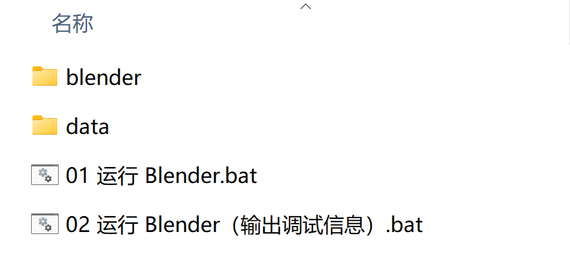

# 文档更新记录

2024-10-09：

- 新增 Gitee 仓库。
- 新增夸克网盘下载通道。
- 修改问题反馈渠道。

2024-10-07：文档发布

# 项目说明

本项目通过修改 Blender 源码，完善 Blender 在 Windows 平台中对输入法的支持。

修改后的源码将通过合并请求的方式提交给官方。

为了称呼的方便，修改后的 Blender 暂且称为 Blender 输入法增强版。

# 项目进度

[进行中] **公测**

    对公众开放 Blender 输入法增强版的测试，收集并修复问题。
    
    截止至 2025年正月十五（2025-02-12）。

[进行中] **编写技术说明文档**

    为了让合并请求顺利通过，面向官方开发人员编写一份包含技术背景和实现指南的技术说明文档尤为重要。

    截止至 2025 年正月十五（2025-02-12）。

[未开始] **发起特性请求**

    根据官方的指引，涉及特性的增减改动，需要先在开发者论坛和开发人员交流后，再根据情况发起合并请求。

    期间会发起 “WIP”（Work in progress，正在施工）的合并请求（非正式请求，仅用于展示源码）。

    用时不定。

[未开始] **发起合并请求**

    在开发者论坛中获得官方开发人员认同后，正式发起合并请求，并等待通过。

    一般几天内会完成合并。

[未开始] **等待特性上线**

    新特性一般会出现在当时最近版本的 Alpha 阶段中，只要没有大问题，到 Release 阶段就会正式上线。

    最快 5 个月，最长 6 个月。

# 项目记录

2024-10-07：公测开始。

2024-09-30：正式立项。

2024-07-17：确定改造方案。

2024-02-XX：前期探索完毕。其副产物就是2024-03-31发布的输入法助手V3版。

2023-11-XX：项目前期探索。

# 相关链接

1、**项目说明文档**

就是本文档。用于说明项目相关信息。

2、**项目相关视频**

- [Blender 输入法增强版公测](https://www.bilibili.com/video/BV19N11YKEu3/)

3、**项目开源仓库**

- [GitHub](https://github.com/Arius-Cr/blender-ime-aware-in-windows)

- [Gitee](https://gitee.com/arius-cr/blender-ime-aware-in-windows)

**注意**：该仓库仅用于公开源码和收集问题反馈，当整个项目完成后，该仓库将会被**删除**！。

仓库中各个分支的用意（main 分支没用）：

- ime-aware-in-windows

    输入法增强版分支。

    名称类似的分支，如“ime-aware-in-windows-4.2”，则为基于 4.2.X 的输入法增强版。

- ime-aware-in-windows-docs

    技术说明文档等。阅读源码前最好看一下该文档，能够帮助你快速了解源码之间的关系。

# 反馈渠道

你可以在以下渠道中反馈问题：

1. 以下视频的评论区：

    - [Blender 输入法增强版公测](https://www.bilibili.com/video/BV19N11YKEu3/)

2. B站私信

    私信的第一条消息必须表明反馈的问题是什么，否则不予回复。

3. GitHub 或 Gitee 仓库

    反馈问题时能附带图片和视频是最好的，当然最重要的是，尽量提供可以重新触发问题的步骤。

**注意**：

反馈时请写明使用的是哪个版本哪个日期的 Blender 输入法增强版。

这个版本和日期写在你下载的压缩包的名称中。

如：Blender_4.2.2_ime_aware_2024_10_07.7z

其中 “4.2.2” 和 “2024_10_07” 就是版本和日期。

# 测试指南

## 1、下载

下载地址：

[百度网盘](https://pan.baidu.com/s/1pDZzNVQxKqX_3UH95d6K-A?pwd=k1ab)

[夸克网盘](https://pan.quark.cn/s/8f90fade8802)

提供的是官方版本对应的输入法增强版，根据自己平时使用的 Blender 版本下载即可。

下载后直接解压即可，无需安装。

## 2、运行

解压后应该会看到以下文件和目录：

双击 “01 运行 Blender.bat” 或 “02 运行 Blender（输出调试信息）.bat” 均可运行输入法增强版。

两者的区别在于 “01” 不会输出任何调试信息，而 “02” 会输出输入法相关的调试信息。

如果你需要在平时的使用环境（偏好设置、插件等）中测试输入法增强版，请将你平时使用的 Blender 的用户目录中的所有文件和目录复制到 “data” 目录中。譬如你正在使用 Blender 4.2.2，则用户目录为 “%APPDATA%\Blender Foundation\Blender\4.2”，复制这个路径到文件资源管理器的地址栏后按回车键即可导航到该目录。然后复制这个目录中的所有文件和目录（注意是 “4.2” 这个**目录内的文件和目录**，不是 “4.2” 这个目录），粘贴到输入法增强版的 “data” 目录。然后重新运行输入法增强版即可。

输入法增强版无法直接通过双击 “blender.exe” 或 “blender-launcher.exe” 运行，必须通过上述的两个 BAT 脚本运行。

这两个 BAT 脚本本质上只是在运行 Blender 前设置了相关环境变量，并且重定向了 Blender 的用户目录，避免输入法增强版和官方版使用相同的用户目录。

## 3、测试

随意进行测试即可。

# 功能介绍

下面介绍一下 Blender 输入法增强版相对官方版改变的功能。

注意：仅在 Windows 平台可用。

输入法增强版没有修改 .blend 文件的格式，因此文件和官方版可互通。

输入法增强版功能包括：

1. 官方：仅支持在文本框使用输入法。

    改动：支持在文本框、文本物体编辑模式（3D视图中）、文本编辑器、控制台中使用输入法。

    在3D视图、文本编辑器、控制台 中，只有当鼠标悬停在这些编辑器的主区块（中间的哪个区域，不包括标题栏、侧边栏等），且当前需要文本输入时（譬如文本物体处于编辑模式，文本编辑器关联了文本对象等），输入法才会开启，否则都会自动关闭。

    在文本物体编辑模式中，正在输入的文本被中括号（[]）包围，以突出显示。

    在文本物体编辑模式中，输入法候选窗口的左侧总是对齐到当前3D视图底部的40%的位置，不支持自定义位置（插件版支持自定义位置）。

2. 官方：使用输入法输入时，部分按键在某些情况下无效，包括：

    - 大写锁定时无法输入字符

    改动：输入法增强版已修复上述问题。

3. 官方：在激活文本框后，如果不输入文本就退出文本框，则输入法依然保持开启。

    改动：只要退出文本框，就会自动停用输入法。

4. 官方：在数值框中启用输入法。

    改动：在数值框中停用输入法。

5. 官方：在弹出菜单中使用搜索菜单项功能时，第一字母按键不触发输入法。

    改动：第一个字母按键可以正常触发输入法。
    
    注意：如果你在程序中最后一次使用输入法时，处于英文输入模式，则第一个字母按键会被认为是在英文输入模式时输入的，不会触发输入法。

插件版（输入法助手）和增强版的区别：

- 插件版仅有功能 1、2、3；
- 运行效率相对增强版低；
- 根据部分用户反馈，插件版在特定的环境中表现异常（一直无法获取问题样本，因此问题一直未能解决）。
